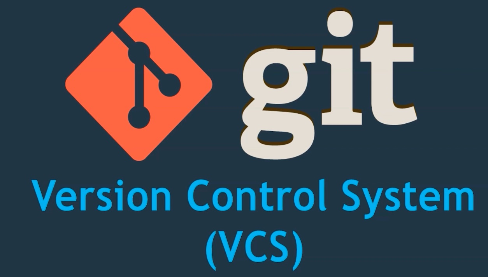
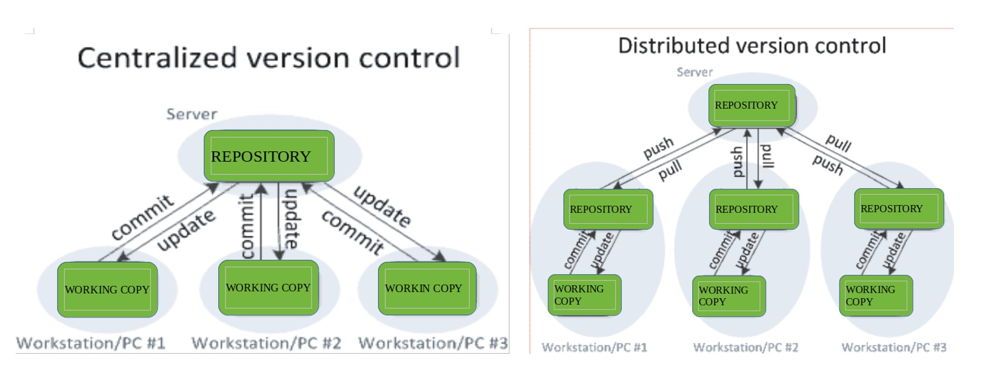
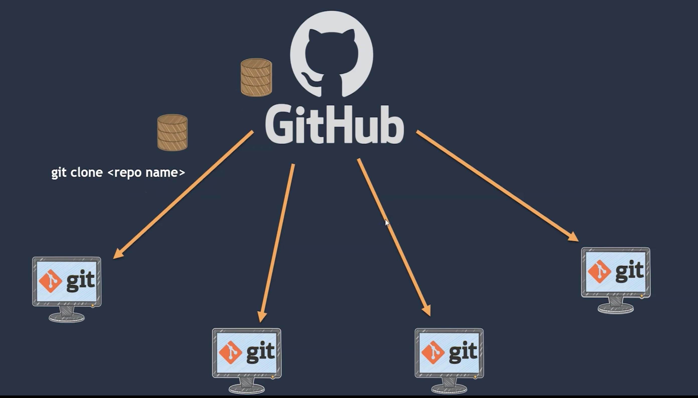
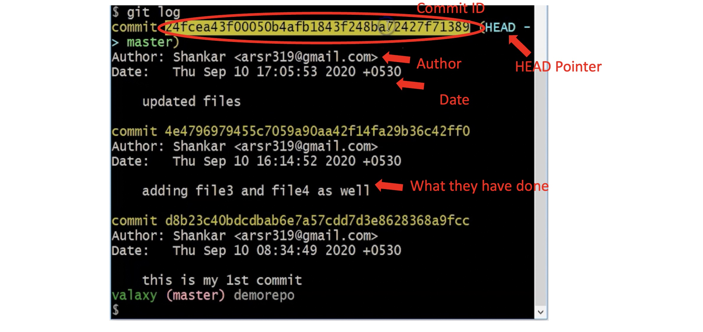
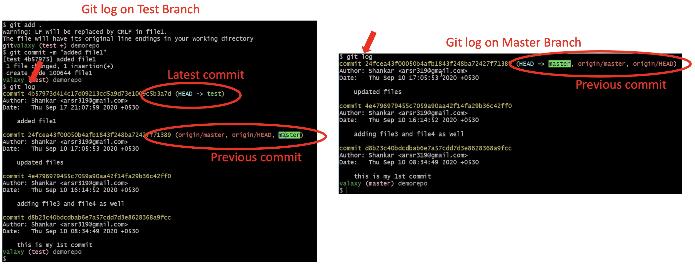
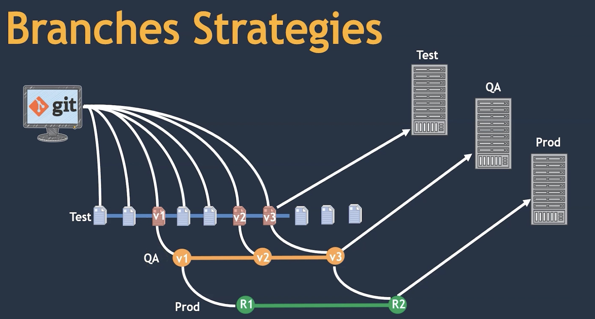
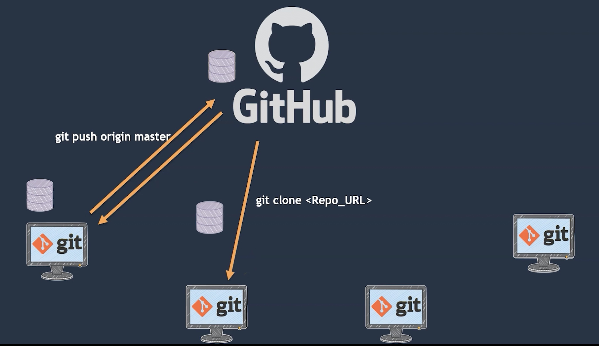
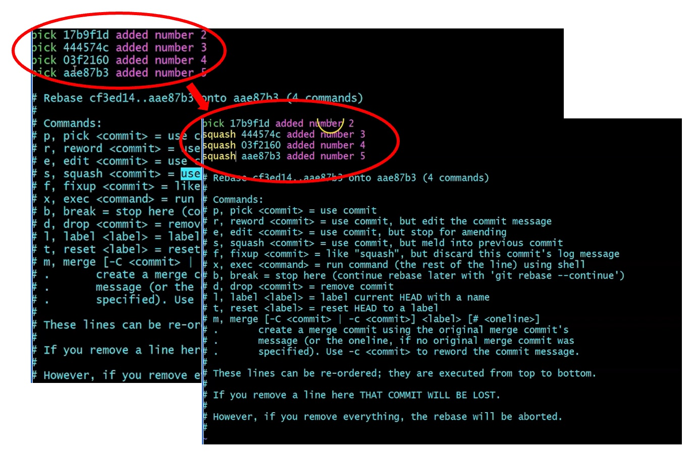

# Git & Github Documentation

This documentation serves as a comprehensive guide for utilizing Git and Github for efficient code collaboration. It includes a detailed explanation of the necessary commands and practices required to effectively manage and share code within a team environment

1. **[Configure Git](#Configure-Git)**

1. **[Git Installation](#Git-Installation)**

1. **[Remote & Local Git Connection](#Remote-&-Local-Git-Connection)**

___

## Version Control System

Version control systems are software tools that help software teams manage changes to source code over time: 

- A system that keeps records of your changes
- Allows for collaborative development
- Allows you to know who has made what changes and when
- Allows you to revert any changes

**Version Control System types**: 

- **Local**: It is the simplest form of Version Control System and has a database in a sigle computer; tracking all the changes to files under revision control. 
    - Only `git commit` command is needed into a folder/repository, in a single computer. With the `git commit` command you store a snapshot/version of the current code.
    
- **Centralized**: contain just one repository globally and every user need to commit for reflecting one’s changes in the repository. It is possible for others to see your changes by updating. It has some downsides such as the single point of failure that the centralized repository represents if it goes down during that period collaboration and saving versioned changes is not possible. 
    - `git` operations are needed into a folder in a local server (remote), with multiple computers access this server's folder. Each single computer uses `update` command to receive the updated version of this folder, and uses `commit` command to send and store a snapshot/version of the current code to the remote server's folder.
    
- **Distributed**: contain multiple repositories. Each user has their own repository and working copy. Just committing your changes will not give others access to your changes. This is because commit will reflect those changes in your local repository and you need to push them in order to make them visible on the central repository.
    - Both `git` and Github used for this Version Control System type. Briefly the main commands are:
        - `clone` command which bring a repository that is hosted somewhere like Github into a local folder repository on your local machine, for the first time.
        - `pull` command which updates, download changes from remote repository to your local machine.
        - `push` command which upload your local changes commited on your local repository to the remote repository (master of branch), like Github.
        - `commit` command which store a snapshot/version of the current code to the local git repository Version Control System.
        - `update` command which upload the files in the local folder with the latest changes from the ocal git repository.
        

___

## Git Installation (Locally or Server)

Make sure git is installed to your local computer:

- Install **git** through terminal (Linux OS):
a. `$ sudo apt-get install git`

- Check **git** version:
b. `$ git --version`
      
___
     
## Creating Git Repository Locally & Remotely

- **For local repository use** (this is for the Local Control System type):    

    - a. create a folder  which will be the repository `$ mkdir [Folder_Name]`  

    - b. get into this repository `$ cd [Folder_Name]` and Initialize git `$ git init .` 

    - c. this will create a .git file and this is how you initialize local git repository   

- **For global repository use** (this is for the Distributed Control System type):    
  
    - a. create a GitHub repository following this guidelines:  [Create a Repo](https://docs.github.com/en/get-started/quickstart/create-a-repo)  

    - b. Connect your remote (GitHub) repository to your local computer follow the guidelines: [Remote & Local Git Connection](#Remote-&-Local-Git-Connection)

    - c. use `clone` command which will bring this remote repository you created on your local machine, for the first time.

___

## Remote Git Connection to GitHub

Connect your local computer/repo with your GitHub account (remote repos) for Linux OS:

**SSH Public/Private key** pair generated needed for Git clone:

a. `$ ls -al ~/.ssh/id_rsa.pub`
        (if a returned nothing continue to step b)

b. `$ ssh-keygen` (use default options - just press only Enter)

c. Go to the directory: `$ cd ~/.ssh`
    
d. Open the file `$ atom id_rsa.pub` and copy the key, the entire content of the file.
    
e. Go to your `Github > Setting > SSH and GPG keys > New SSH key` and and a new SSH key by copying the key from the `id_rsa.pub` file.  

f. now you are ready to clone and update your repositories. 

___

## Git Structure (Workflow)

Git is a powerful version control system, is composed of three distinct layers: the working layer, the staging layer, and the committed layer.
- The **working layer** is the physical location where developers write and make changes to their code.
- The **staging layer**, managed by Git, tracks the changes made to the code in comparison to the previous versions. 
    - It operates like an agent which track what you modify to your working layer.
- Finally, the **scommitted layer**s comprises a historical record of snapshots of the code, preserving each version as it was at the time of committing.
    - It operates like a record keeper, with all the history o previous code versions/snapshots.

In more detail:

- The **working tree (directory)** contains the current state of the project, including any changes that have made. The command `git status` in what stage the files in the repository are at. Each file in the working directory can be in one of two states:
    - **Untracked**: Untracked files are any files in the working directory that were not in the last snapshot and are not in the staging area. Whenever a new file is added in the working directory which doesn’t exist before, it is considered as an untracked file. This is because Git sees this as a file that didn’t have in the previous snapshot(commit).
    - **Tracked***: Tracked files are files that were in the last snapshot. These are files that Git knows about, and they are Modified or not. modified files means that changes have been made to it that haven’t committed yet. The changes could be adding, modifying, or deleting the contents of the file. These files will be included in the next commit but will be included in their respective new form.

- **Staging area**: A file in the staging state means either it is not present in the last commit (e.g. newly created files) or it is “modified” file that user tells git to include in the next commit. Untracked files are added to the staging state using `git add` command.

- **Committed/Repository area**: A file in the committed state means that the changes made to it are safely stored in a snapshot in the Git directory. A file is committed using `git commit` command.

   

___

## Get a repository from the remote GitHub repository for the first time 

`Clone` command and installation of the repository.

a. `$ cd [Your_Repo_Folders]`

b. `$ git clone git@github.com:PATH_REPO_NAME.git`
      
   - for example: `$ git clone git@github.com:jasonjamsden/CAMMS_Tutorials.git`
   

___

## Take the latest Update from the Master repository

When you already have the copy of a repository in your local machine.

a. `$ git pull`
- Pull & Syncs the changes from Remote Repository to Local Repository & Working Directory
    - The `pull` **syncs** the local Repository from the remote Repository
    - AND (at the same time) pulls all the changes to the **Working Directory**

b. `$ git fetch origin master` or `$ git fetch`
- Pulls the changes from Remote Repository to Local Repository
   - The `fetch` ONLY **syncs** the local Repository from the remote Repository
   - You will **not** see the changes of the files in the Working Directory. You need after `fetch` to execute `$ git merge` to sync the the **Working Directory**.

If you do not want to disturb local changes of your working directory put you want to pull all the updates use `fetch`.

___

## Steck Status (of the local git repo)

Mainly `$ git status` command checks local changes in your local computer relative to the snapshot you downloaded from the remote repository. In particular: 
- What changed in the working directory, by presenting changes on untracked and tracked files. 
- what need's to placed in the staging area (*red color*), by using the command `git add`
- what already is in the staging area (*green color*).
- what is ready to be commited, by using the command `git commit`

a. `$ cd REPO_NAME` 

- to the particular git repo and check status: 

b. `$ git status`

___

## Track Local Git Changes

### `git log` command:

- Show commit history:

`$ git log` 

- When `$ git commit` is execute it stores a snapshot/version of the current code to local repository. **Each commit has an ID** which a number, this is a reference number to particular commit and by using this commit ID we may change between different commit snapshots/versions of the code.

- When `$ git log`  is execute it is presents all the commit History, with their IDs starting with the most recent commit at the top and goes backwards through previous versions. 

- In the `git log` we see `HEAD > [BRANCH NAME]`, where `HEAD` points to the latest commit of the particular branch. Depend on which branch you are the commit history and the `HEAD` may vary, see the Branch Section bellow: **[Git Branches](#Git-Branches)**.

### 
### `git show` command:

- See latest local commit changes:

`$ git show`   

- See local commit changes of a particular commit with ID:

`$ git show [commit_ID]`   

### 
### `git annotate` command:

- See **who** **when**, and **what** local commit changes of a particular FILE:

`$ git annotate [file_name]`   

### 
### `git diff` command:

See particular local changes between different branches (working area with the staging area)

- See current local changes between working area with the staging area:

`$ git diff` 

- See current local changes between local repo (local commits) and staging area:

`$ git diff --staged` or `$ git diff --staged HEAD`  

- See current local changes between local repo (local commits) and working area:  

`$ git diff HEAD`    

- See local changes between two different commits A and B (each commit has an ID when is get commited and you can take this ID by executing `git log`):

`$ git diff [Commit_ID_A] [Commit_ID_B]`    

or

- See local changes between latest commit (HEAD) and N commit back where N is number (HEAD~N):

`$ git diff HEAD HEAD~N`   

___

## Git Branches

In Git, using branches is a standard practice in software development. A branch is essentially a reference to a specific version of your code. When working on new features or bug fixes, you create a new branch to isolate these changes. Once you've made your changes and received approval from your team, you can then merge the branch with the main branch or discard it without impacting the previous version of your code.

- Check in the list of branches and which branch you currently are with a star infront of the branch name:  

`$ git branch`

- Swiche to one other branch: (or `git switch` basically does the same)

`$ git checkout BRANCH_NAME`

- Create a swiche to a new branch:

`$ git checkout -b NEW_BRANCH_NAME`

- Delete branch:

`$ git branch -d BRANCH_NAME`

### Each `commit` refers to a a specific branch or branches:

In the above example, we created a **test branch** and made some changes. These changes were then committed, becoming the latest version of the repository. However, it's important to note that only the test branch contains these commits. The master branch, which is the **main branch** and commonly referred to as the "HEAD," still holds the previous commit snapshot. This can be observed by looking at the commit information next to the previous commit. 
-  By using `$ git log` in the **test branch** we see the aforementioned list of commit history. HOWEVER if we change branch with `$ git checkout master` and then we execute `$ git log` we only see as latest commit the current  **main branch** commit. 
- By using `$ git merge` commands you may change which commit each branch will contain. 

### Why you need a branching strategy in DevOps:   

A branching strategy helps define how the delivery team functions and how each feature, improvement, or bug fix is handled. It also reduces the complexity of the delivery pipeline by allowing developers to focus on developments and deployments only on the relevant branches—without affecting the entire product.

___

## Git merge branches changes

a. you are in the master branch and you want to merge the changes with of the [BRANCH_NAME] branch to the master branch

b. you execute the command `$ git merge [BRANCH_NAME]`

___

## MODIFIED FILES: Save an commit local changes to your **local git**:

- Make some local code changes to a previously existing file and save this file.

- adds and commits at the same time for modified files NOT newly created files
`$ git commit -am "COMMENT_OF_COMMIT"` where `-a` stands for add and `m` stands for message

___

## NEW FILES: Save an commit local changes to your **local git**:

- Create a new file named FILE_NAME.

- Save it and track it through git: 

    - Track all the untracked and modified files: 

    `$ git add .`

    - Track a particular file:
    
    `$ git add FILE_NAME`
   
- Commit the changes to your local computer git:

`$ git commit -m "COMMENT_OF_COMMIT"` where and `m` stands for message.

___

## Send and Store local commits to the **remote repository**:

**Save local changes to the Repote/Master remote "original" git**

after executing the local `$ git commit` changes you wanted to have push changes to the global/remote repository:

`$ git push origin [BRANCH_NAME]`

where [BRANCH_NAME] is one of the branches from the `$ git checkout BRANCH_NAME` listx 

___

## Configure Git

The git config command is a convenience function that is used to set Git configuration values on a global or local project level.

- Print all git information:
`git config --list`  

- Print git user information:

`git config --global user. name`  

`git config --global user.email`

- Update/Include user information to the commits:

`git config --global user. name "Jacob"`   

`git config --global user. email "jacob.kritikos@gmail.com"`   

___

## Git Tags

Each Git commit has an ID, which can be replaced with a tag for easier access if we need to revert to a specific commit in the past.

- See the tag of the current commit (if nothing is printed no tag exists for this commit):
`git tag`
- Add a tag of the current commit:
`git tag v1.0` (where the tag is `v1.0` you may place whatever you want to remember about this commit)

- Add a tag of a spesific commit:
`git tag [commit ID] [TAG NAME]` 

___

## Git Revert 
Unstage or even discard uncommitted local changes.

- Restore from Staging area to the working directory with `git restore` (that you cannot undo this!)
    - Discard local changes in a [file], restoring the [file] to last committed state:

`git restore [file_name]`  or `git checkout -- [file_name]` 

- Removes the file from the Staging Area, but leaves its actual modifications untouched to the working directory.
`git restore --staged [file_name]` 

- Restore from Repository to staging area with `git reset`
`git reset HEAD^[N]` where [N] is the cap and is the number of commits to bring back if N=1 there is the last commit

- Restore from Repository to working directory with `git reset`
    - Removes the file from the Staging Area, but leaves its actual modifications untouched.
    
`git reset HEAD^[N]` AND after `git restore [file_name]`

___

## .gitignore File

Avoid pushing unnecessary files to the git repository. Specifies intentionally untracked files that Git should ignore

a. Create a file `touch .gitignore`, or access to the `vi .gitignore`

b. Include to this `.gitignore` file the names of the files you want git commits (i.e. to `*.txt`) ignore as a list. Save & Exit the `.gitignore` file.

c. That's it, now you need to commit the `.gitignore` file.

___

## Git Rebase

Combining a sequence of commits to a new base commit

a. execute `git rebase -i HEAD~[N]` where [N] is the number of the N latest commits you want to squeeze 

b. a file will open replace all `pick` words exept the first with the `squash` word

___

# References

This Documentation is mainly based on the following [PacktHub DevOps Complete Course](https://www.packtpub.com/product/devops-complete-course-video/9781804615508) course.

Additional Links: 

- https://www.youtube.com/watch?v=RGOj5yH7evk
- https://www.youtube.com/watch?v=MnUd31TvBoU  
- Revert: https://www.git-tower.com/learn/git/commands/git-restore
- [What is version control?](https://www.atlassian.com/git/tutorials/what-is-version-control)
- [Version Control Systems](https://www.geeksforgeeks.org/version-control-systems/)
- [States of a File in Git Working Directory](https://www.geeksforgeeks.org/states-of-a-file-in-git-working-directory/)
- [DevOps Branching Strategies Explained](https://www.bmc.com/blogs/devops-branching-strategies)

- [Link](LINK)

