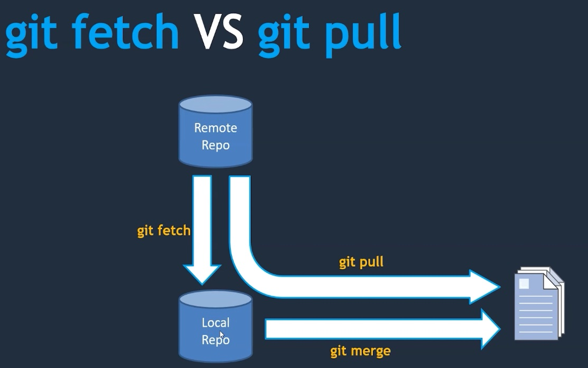
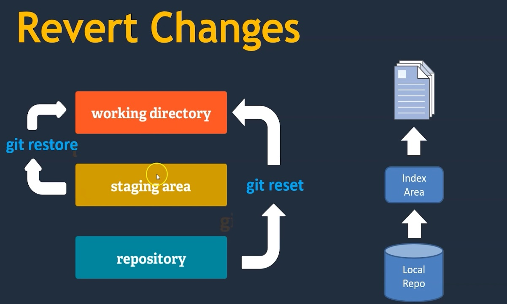

# Make sure git is installed:

- Install **git** through terminal:
a. `$ sudo apt-get install git`

- Check **git** version:
b. `$ git --version`
      
# Connect your local computer with your GitHub account:

**SSH Public/Private key** pair generated needed for Git clone:

a. `$ ls -al ~/.ssh/id_rsa.pub`
        (if a returned nothing continue to step b)

b. `$ ssh-keygen` (use default options - just press only Enter)

c. Go to the directory: `$ cd ~/.ssh`
    
d. Open the file `$ atom id_rsa.pub` and copy the key, the entire content of the file.
    
e. Go to your `Github > Setting > SSH and GPG keys > New SSH key` and and a new SSH key by copying the key from the `id_rsa.pub` file.  

f. now you are ready to clone and update your repositories. 

# Basic Git Commands:

- **clone** -> Bring a repository that is hosted somewhere like Github into a folder on your local machine.
- **pull** -> Download changes from remote repo to your local machine, the opposite of push
- **add** -> Track your files and changes in Git.
- **commit** -> Save your files in Git **locally**.
- **push** -> Upload Git commits to a remote repo (master of branch), like Github.

### **Clone and install a repository:**

a. `$ cd ~`

b. `$ git clone git@github.com:PATH_REPO_NAME.git`
      
   - for example: `$ git clone git@github.com:jasonjamsden/CAMMS_Tutorials.git`
   
### **Take the latest Update from the Master repository:**

a. `$ git pull`
- Pull & Syncs the changes from Remote Repository to Local Repository & Working Directory
    - The `pull` **syncs** the local Repository from the remote Repository
    - AND (at the same time) pulls all the changes to the **Working Directory**

b. `$ git fetch origin master` or `$ git fetch`
- Pulls the changes from Remote Repository to Local Repository
   - The `fetch` ONLY **syncs** the local Repository from the remote Repository
   - You will **not** see the changes of the files in the Working Directory. You need after `fetch` to execute `$ git merge` to sync the the **Working Directory**.

If you do not want to disturb local changes of your working directory put you want to pull all the updates use `fetch`.

### **Steck Status of the local git repo:**

- This will check **ONLY** local changes in your local computer relative to the master git as you downloaded, which haven't yet commited locally, **NOT** changes and updates in the master branch.

a. `$ cd REPO_NAME` 

- to the particular git repo and check status: 

b. `$ git status`

- or see particular local changes between different branches (working area with the staging area):

c. `$ git diff` 

- or  Show commit logs:

d. `git log`

### **Track Local Git Changes**

- See latest local commit changes:

`$ git show`   

- See local commit changes of a particular commit with ID:

`$ git show [commit_ID]`   

- See **who** **when**, and **what** local commit changes of a particular FILE:

`$ git annotate [file_name]`   

- See current local changes between working area with the staging area:

`$ git diff` 

- See current local changes between local repo (local commits) and staging area:

`$ git diff --staged`    

- See current local changes between local repo (local commits) and working area:  

`$ git diff HEAD`    

- See local changes between two different commits A and B (each commit has an ID when is get commited and you can take this ID by executing `git log`):

`$ git diff [Commit_ID_A] [Commit_ID_B]`    

or

- See local changes between latest commit (HEAD) and N commit back where N is number (HEAD~N):

`$ git diff HEAD HEAD~N`   

### **Git branches:**

- Check in the list of branches and which branch you currently are with a star infront of the branch name:  

`$ git branch`

- Swiche to one other branch: (or `git switch` basically does the same)

`$ git checkout BRANCH_NAME`

- Create a swiche to a new branch:

`$ git checkout -b NEW_BRANCH_NAME`

- Delete branch:

`$ git branch -d BRANCH_NAME`

### **Git merge branches changes:**

a. you are in the master branch and you want to merge the changes with of the [BRANCH_NAME] branch to the master branch

b. you execute the command `$ git merge [BRANCH_NAME]`

### **MODIFIED FILES: Save an commit local changes to your local git:**

- Make some local code changes to a previously existing file and save this file.

- adds and commits at the same time for modified files NOT newly created files
`$ git commit -am "COMMENT_OF_COMMIT"` where `-a` stands for add and `m` stands for message

**NEW FILES: Save and commit local changes to your local git:**

- Create a new file named FILE_NAME.

- Save it and track it through git: 

    - Track all the untracked and modified files: 

    `$ git add .`

    - Track a particular file:
    
    `$ git add FILE_NAME`
   
- Commit the changes to your local computer git:

`$ git commit -m "COMMENT_OF_COMMIT"` where and `m` stands for message.

**Save local changes to the Master remote "original" git**

`$ git push origin [BRANCH_NAME]`

where [BRANCH_NAME] is one of the branches from the `$ git checkout BRANCH_NAME` listx 

**Pull Requests & Reviewers **
- How to do coding peer reviews with Github: https://www.youtube.com/watch?v=8fx-EaOUK2E

### Configure Git

- Print all git information:
`git config --list`  

- Print git user information:

`git config --global user. name`  

`git config --global user.email`

- Update/Include user information to the commits:

`git config --global user. name "Jacob"`   

`git config --global user. email "jacob.kritikos@gmail.com"`   

### Git Tags

Each Git commit has an ID, which can be replaced with a tag for easier access if we need to revert to a specific commit in the past.

- See the tag of the current commit (if nothing is printed no tag exists for this commit):
`git tag`
- Add a tag of the current commit:
`git tag v1.0` (where the tag is `v1.0` you may place whatever you want to remember about this commit)

- Add a tag of a spesific commit:
`git tag [commit ID] [TAG NAME]` 

### Git Revert 
Unstage or even discard uncommitted local changes.

- Restore from Staging area to the working directory with `git restore` (that you cannot undo this!)
    - Discard local changes in a [file], restoring the [file] to last committed state:

`git restore [file_name]`  or `git checkout -- [file_name]` 

- Removes the file from the Staging Area, but leaves its actual modifications untouched to the working directory.
`git restore --staged [file_name]` 

- Restore from Repository to staging area with `git reset`
`git reset HEAD^[N]` where [N] is the cap and is the number of commits to bring back if N=1 there is the last commit

- Restore from Repository to working directory with `git reset`
    - Removes the file from the Staging Area, but leaves its actual modifications untouched.
    
`git reset HEAD^[N]` AND after `git restore [file_name]`

### .gitignore File

Avoid pushing unnecessary files to the git repository. Specifies intentionally untracked files that Git should ignore

a. Create a file `touch .gitignore`, or access to the `vi .gitignore`

b. Include to this `.gitignore` file the names of the files you want git commits (i.e. to `*.txt`) ignore as a list. Save & Exit the `.gitignore` file.

c. That's it, now you need to commit the `.gitignore` file.

### Git Rebase

Combining a sequence of commits to a new base commit

a. execute `git rebase -i HEAD~[N]` where [N] is the number of the N latest commits you want to squeeze 

b. a file will open replace all `pick` words exept the first with the `squash` word

# Reference
- https://www.youtube.com/watch?v=RGOj5yH7evk
- https://www.youtube.com/watch?v=MnUd31TvBoU  
- Revert: https://www.git-tower.com/learn/git/commands/git-restore

